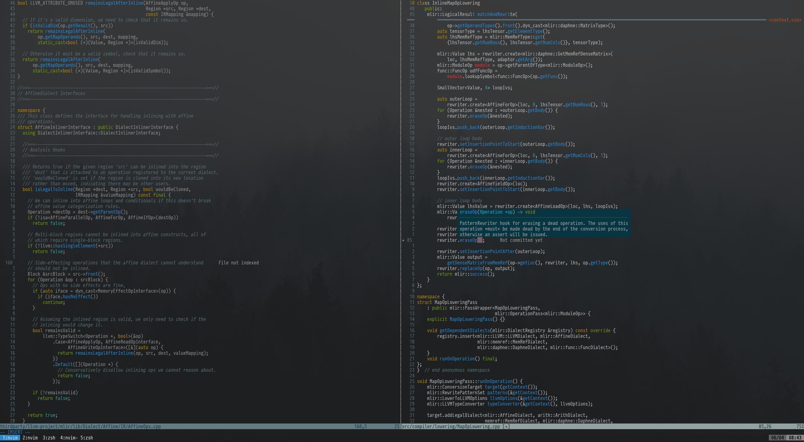

# dotfiles
> These are my personal dotfiles for most of the software I use. Feel free to copy whatever you like.

## Installation
I use `GNU stow` to manage my dotfiles.

### Linux

    sudo apt install stow

### macOS

    brew install stow

## Symlink

    git clone git@github.com:philipportner/dotfiles.git

    stow *

## Software
- Neovim + various language servers
- i3/regolith
- zsh + ohmyzsh
- fzf
- alacritty
- tmux
- GNU stow
- ctags
- clang-format
- pylint
- ranger
- PragmataPro
- tree
- bat
- zathura
- exa
- xclip
- flameshot
- autojump
- onefetch
